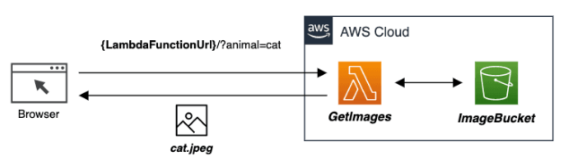

# Configuring HTTPS Endpoints on AWS Lambda Functions

AWS Lambda Function URLs are dedicated HTTPS endpoints for Lambda functions. With Lambda function URLs, developers do not need to rely on an intermediary service like API Gateway to map Lambda functions to HTTPS calls.

In this lab, you will create a Lambda function URL for a new AWS Lambda function using the AWS console. 



```sh
import base64
import boto3
 
s3 = boto3.client('s3')
 
def lambda_handler(event, context):
    animal = 'cat'
    if 'queryStringParameters' in event:
        animal = event['queryStringParameters']['animal']
 
    response = s3.get_object(
        Bucket='<your-bucket>',
        Key= animal + '.jpeg',
    )
    image = response['Body'].read()
 
    return {
        'headers': { "Content-Type": "image/jpeg" },
        'statusCode': 200,
        'body': base64.b64encode(image),
        'isBase64Encoded': True
    }
```